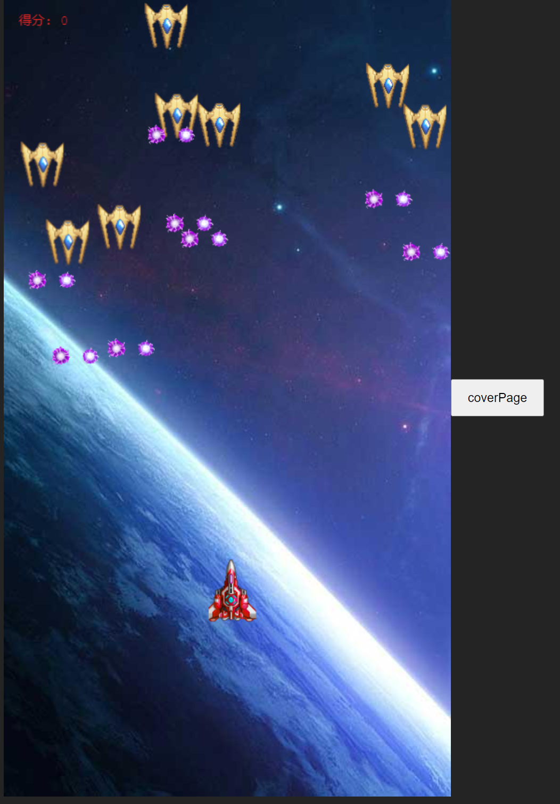

# ThunderCross
Use vue3 + Phaser3 for game development.
It's hard to find game assets. 😥😥😥

There are some bugs, please forgive me

Game Demos: 
[https://leroyk111.github.io/ThunderCross/](https://leroyk111.github.io/ThunderCross/)

The development documentation for phaser3 is terrible
I don't want to use it again